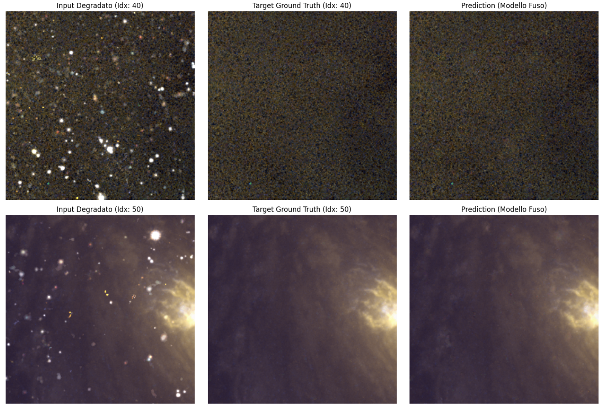

# clearsky

## ⚠️ Important

This is the repository for the **DLAI project**.

- The **notebooks** used for training all the models are all available [here](./notebooks/).
  - [Pretraining](./notebooks/pretraining.ipynb) is the notebook for the pretrained model
  - [Image Restoration](./notebooks/image-restoration.ipynb) is the notebook for the specialist on the image restoration task
  - [Super Resolution](./notebooks/super-resolution.ipynb) is the notebook for the specialist on the super resolution task
  - [Star Removal](./notebooks/star-removal.ipynb) is the notebook for the specialist on the star removal task
  - [Task Arithmetic Merging](./notebooks/task-arithmetic-merging.ipynb) is the notebook for the Task Arithmetic merging
  - [TIES/DARE-TIES Merging](./notebooks/ties-dare-ties-merging.ipynb) is the notebook for the TIES and DARE-TIES merging
  - [Fine-tuned (Task Arithmetic)](./notebooks/fine-tuned-task-arithmetic.ipynb) is the notebook for the fine-tuned Task Arithmetic model
  - [Fine-tuned (DARE-TIES)](./notebooks/fine-tuned-dare-ties.ipynb) is the notebook for the fine-tuned TIES and DARE-TIES model

- The PDF of the **report** is available [here](<https://raw.githubusercontent.com/aflaag/clearsky/main/report/main.pdf>).



The rest of this file is optional.

---

## Overview

The clearsky pipeline processes raw astronomical observations as follows:

1. **Data Ingestion & Stretching**: Converts raw RGB FITS images to normalized `float32` with adaptive `arcsinh` stretching to enhance faint astronomical details while preventing saturation of bright stars.

2. **Reference Generation**: Builds a "doubly clean" ground truth: defect-free (pixel-level dead/hot pixel correction) and starless (via StarNet2 neural network removal). Synthetic stars can be optionally used to avoid generating a distillation dataset.

3. **Synthetic Degradation**: Creates all 7 combinations of three independent degradation types:
   - **SR** (Star Removal): synthetic stars injected from real extracted stamps
   - **IR** (Image Restoration): dead/hot pixel defects
   - **SU** (Super-Resolution): blur + downsample + upsample degradation
   - Plus all 3-choose-2 and 3-choose-3 combinations (SR_IR, SR_SU, IR_SU, SR_IR_SU)

4. **Aligned Patch Extraction**: Samples training patches from all 7 combinations at identical sky coordinates using a shared manifest, ensuring valid cross-degradation comparisons.

5. **Dataset Compilation**: Produces paired (degraded_input, clean_target) training sets suitable for DDPM conditioning.

## Pipeline Architecture

### Single-Degradation Pipelines (Run Once Each)

```
Raw FITS
  ├─ pipeline_SR.sh
  │  └─ astro_stretch → make_masks → StarNet2 → build_star_library → inject_stars → make_dataset_sr
  ├─ pipeline_IR.sh
  │  └─ astro_stretch → make_masks → detect_pixel_defects → make_dataset_ir
  └─ pipeline_SU.sh
     └─ astro_stretch → make_masks → degrade_images → make_dataset_su
```

### Multi-Degradation Pipeline (Run Once After Singles)

```
Doubly Clean Reference (from build_clean_reference.sh)
  └─ build_crop_manifest.py → crop_manifest.json
     └─ build_combos.sh → 7 combination folders
        └─ build_all_datasets.sh → dataset_merged/{SR,IR,SU,...,SR_IR_SU}
```

## Usage

### Step 1: Build Single-Degradation Datasets

```bash
bash pipeline_SR.sh   # Star removal
bash pipeline_IR.sh   # Image restoration
bash pipeline_SU.sh   # Super-resolution
```

Each outputs a folder (dataset_sr, dataset_ir, dataset_su) with:

```
dataset_X/
├─ input/npy   # degraded images
├─ input/png   # (optional) visual previews
├─ target/npy  # clean targets
└─ target/png  # (optional) visual previews
```

### Step 2: Build Multi-Degradation Datasets

```bash
# Generate the doubly clean reference if not already done
bash build_clean_reference.sh

# Generate the shared crop manifest (once only)
python build_crop_manifest.py --clean-dir assets/clean/starless-tiff --mask-dir assets/outputs-mask

# Build all 7 combination folders
bash build_combos.sh

# Extract aligned patches for each combination
bash build_all_datasets.sh
```

Output:

```
dataset_merged/
├─ SR/      (stars only)
├─ IR/      (defects only)
├─ SU/      (low resolution only)
├─ SR_IR/   (stars + defects)
├─ SR_SU/   (stars + low resolution)
├─ IR_SU/   (defects + low resolution)
└─ SR_IR_SU/ (all three)
```

## Requirements

- Python 3.8+
- NumPy, SciPy
- astropy (FITS I/O)
- Pillow (PNG export)
- tifffile (16-bit TIFF support)
- StarNet2 binary (for star removal; must be in `./starnet/starnet2`)

Install dependencies:

```bash
pip install numpy scipy astropy pillow tifffile
```

## Repository Structure

| File | Purpose |
|------|---------|
| **Core Utilities** | |
| `astro_stretch.py` | Converts raw RGB FITS to normalized `float32` NPY with adaptive arcsinh stretch; supports paired mode for consistent brightness across input–target pairs. |
| `make_masks.py` | Generates per-image validity masks via local variance thresholding on raw FITS data; identifies regions safe for patch sampling (excludes edges, mosaic gaps, noise). |
| `npy_to_tiff16.py` | Converts float32 NPY `[0,1]` to 16-bit TIFF; bridges scripts requiring TIFF input (e.g., StarNet2, degrade_images.py). |
| **Clean Reference Construction** | |
| `detect_pixel_defects.py` | Detects and corrects dead/hot pixels using local median + robust sigma (MAD); outputs corrected NPY, TIFF, and defect mask TIFF for visualization. |
| `build_clean_reference.sh` | Orchestrates full reference pipeline: runs detect_pixel_defects.py, then StarNet2 on the corrected images to produce doubly clean (starless + defect-free) targets. |
| **Star Removal Pipeline** | |
| `build_star_library.py` | Extracts real star "stamps" (RGB + alpha mask) from original images using StarNet2 masks; catalogs by position, flux, and peak brightness for injection. |
| `inject_stars.py` | Synthesizes massive realistic star fields on starless base images using spatial grid placement algorithm; loads pre-cached star pool for RAM efficiency; supports brightness jitter and augmentation. |
| `make_dataset_sr.py` | Creates (synthetic_with_stars, starless) training pairs by sampling patches from inject_stars.py outputs and pairing with StarNet2 starless targets. |
| `pipeline_SR.sh` | End-to-end star removal pipeline: stretching → masking → StarNet2 → library → injection → dataset. |
| **Image Restoration Pipeline** | |
| `apply_defect_delta.py` | Applies detected pixel defects (real observed values) to any degraded composition; runs last in the chain since defects are sensor readout artifacts independent of underlying signal. |
| `make_dataset_ir.py` | Creates (defective_input, corrected) pairs; uses integral image to preferentially sample patches containing real defects while including "negative" examples (clean patches). |
| `pipeline_IR.sh` | End-to-end restoration pipeline: stretching → masking → defect detection → dataset. |
| **Super-Resolution Pipeline** | |
| `degrade_images.py` | Simulates classical SR degradation: Gaussian blur → downsample (4×) → bicubic upsample; outputs degraded NPY upsampled back to HR resolution for conditioning. |
| `make_dataset_su.py` | Creates (degraded_input, high_resolution) pairs by pairing degraded NPY with original HR TIFF targets. |
| `pipeline_SU.sh` | End-to-end super-resolution pipeline: stretching → masking → degradation → dataset. |
| **Multi-Degradation Merging** | |
| `build_crop_manifest.py` | Generates `crop_manifest.json` with fixed patch positions and augmentations sampled ONCE on the shared clean reference; ensures identical sky portions across all 7 combinations. |
| `build_combos.sh` | Builds all 7 degradation combinations by composing clean reference with injected stars, defects, and degradation; outputs assets/combos/{SR,IR,SU,SR_IR,SR_SU,IR_SU,SR_IR_SU}. |
| `make_dataset_merged.py` | Extracts (degraded_input, clean_target) crops for one combination using fixed positions from crop_manifest.json; deterministic (no sampling), enabling valid cross-combo comparison. |
| `build_all_datasets.sh` | Batch runner: iterates all 7 combination folders, calls make_dataset_merged.py on each with shared manifest and target directory. |
